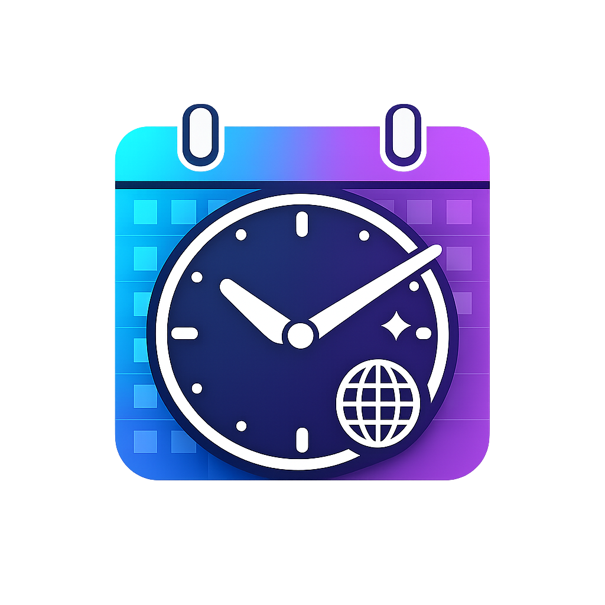

<div align="center">



# Epoch

**Multi-timezone world clock and calendar for macOS**

A lightweight menu bar app to manage multiple time zones and stay organized with an integrated calendar.

[](https://opensource.org/licenses/MIT)
[](https://github.com/JonathanVargas0111/Epoch/releases)
[-lightgrey)](https://github.com/JonathanVargas0111/Epoch)

[Download Latest Release](https://github.com/JonathanVargas0111/Epoch/releases/latest) • [Report Bug](https://github.com/JonathanVargas0111/Epoch/issues) • [Request Feature](https://github.com/JonathanVargas0111/Epoch/issues)

</div>

---

## ✨ Features

### 🌍 Clock Management
- **Multiple time zones** - Add unlimited clocks for different locations
- **Drag & drop reordering** - Organize your clocks the way you want
- **Time difference indicators** - See offset from your local time at a glance
- **Quick copy** - Click any clock to copy the time to clipboard
- **Copy all** - One-click to copy all timezone times

### 📅 Calendar
- **Integrated month view** - Built-in calendar with easy navigation
- **System integration** - Click any date to open macOS Calendar app
- **Current day highlight** - Never lose track of today

### 🎨 Customization
- **Layout options** - Switch between horizontal and vertical layouts
- **Font sizes** - Choose from Small, Medium, or Large
- **Menu bar display** - Show time (12:34), date (22/12), or month+day (DEC 22)
- **Themes** - Dark mode and Light mode support

### ⚡ Productivity
- **Global shortcut** - Toggle window with `Cmd+Shift+C`
- **Persistent storage** - Your clocks are saved automatically
- **Smart prevention** - Can't add duplicate timezones
- **Easy exit** - Quit button built into the interface

---

## 📥 Installation

### System Requirements

- **macOS:** 11.0 (Big Sur) or later
- **Architecture:** Apple Silicon (M1/M2/M3/M4) Macs only
- **Disk Space:** ~120 MB

### Download & Install

**Step 1:** Download the app

Go to the [latest release page](https://github.com/JonathanVargas0111/Epoch/releases/latest) and download one of:
- **Epoch-1.0.0-arm64.dmg** - Recommended for most users
- **Epoch-1.0.0-arm64-mac.zip** - Alternative if DMG doesn't work

**Step 2:** Install to Applications

**If you downloaded the DMG:**
1. Double-click the downloaded `Epoch-1.0.0-arm64.dmg` file
2. A window will open showing the Epoch app
3. Drag **Epoch** to the **Applications** folder
4. Eject the DMG (click the eject button in Finder)

**If you downloaded the ZIP:**
1. Double-click the ZIP to extract it
2. Drag **Epoch.app** to your **Applications** folder

**Step 3:** First Launch (Important!)

⚠️ **Epoch is not code-signed**, so macOS will block it the first time. This is normal and safe - the app is open source and you can review all the code.

**Choose ONE of these methods:**

<details>
<summary><b>Method 1: Right-Click (Easiest)</b></summary>

1. Open **Finder** → Go to **Applications**
2. Find **Epoch.app**
3. **Right-click** (or Control-click) on Epoch
4. Click **Open**
5. In the dialog that appears, click **Open** again
6. ✅ Epoch will launch and appear in your menu bar

</details>

<details>
<summary><b>Method 2: System Settings</b></summary>

1. Try to open Epoch normally (it will be blocked)
2. Open **System Settings** → **Privacy & Security**
3. Scroll down to the Security section
4. Find the message: "Epoch was blocked from use..."
5. Click **Open Anyway**
6. Click **Open** in the confirmation dialog
7. ✅ Epoch will launch

</details>

<details>
<summary><b>Method 3: Terminal (Advanced)</b></summary>

Open Terminal and run:
```bash
xattr -cr /Applications/Epoch.app
open /Applications/Epoch.app
```

✅ Epoch will launch immediately

</details>

> **Note:** You only need to do this **once**. After the first launch, Epoch will open normally.

> **Why unsigned?** Code signing requires a $99/year Apple Developer account. Epoch is free and open source - keeping it unsigned helps us avoid subscription costs.

---

## 🚀 Quick Start

1. **Access Epoch** - Click the time/date in your menu bar, or press `Cmd+Shift+C`
2. **Add a clock** - Click **+ Add Clock**, select a timezone, and click **Add**
3. **Customize** - Click the ⚙️ button to change layout, theme, and display options
4. **Copy times** - Click any clock to copy that time, or use **📋 Copy All** to copy everything
5. **View calendar** - See the current month at a glance, click dates to open Calendar.app
6. **Quit** - Click the **Quit** button when you're done

---

## 💡 Usage Tips

### Adding Multiple Clocks

Available timezones include:
- **Americas:** New York, Los Angeles, Chicago, Mexico City, Bogotá, Buenos Aires
- **Europe:** London, Paris, Madrid
- **Asia:** Tokyo, Shanghai
- **Oceania:** Sydney

You can add a custom label for each clock (e.g., "Home", "Office", "Family").

### Keyboard Shortcuts

- **`Cmd+Shift+C`** - Toggle Epoch window

### Customization Options

**Layout:**
- **Horizontal** - Clocks on left, calendar on right (default)
- **Vertical** - Clocks on top, calendar below

**Menu Bar Icon:**
- **Time** - Shows current time (14:30)
- **Date** - Shows current date (22/12)
- **Month+Day** - Shows month and day (DEC 22)

**Font Size:**
- **Small** - Compact view, fits more on screen
- **Medium** - Default, balanced
- **Large** - Easier to read

**Theme:**
- **Dark** - For dark mode users (default)
- **Light** - For light mode users

---

## 🛠️ Development

Want to contribute or build from source?

### Prerequisites

- Node.js 16 or higher
- npm or yarn

### Setup

```bash
# Clone the repository
git clone https://github.com/JonathanVargas0111/Epoch.git
cd Epoch

# Install dependencies
npm install

# Run in development mode
npm start
```

### Build

```bash
# Build for macOS (Apple Silicon)
npm run build

# Output will be in the dist/ folder
```

### Tech Stack

- **Electron 39.2.7** - Cross-platform desktop apps with web technologies
- **Vanilla JavaScript** - No framework overhead, fast and simple
- **electron-builder** - Package and distribute

---

## ❓ FAQ

<details>
<summary><b>Why is the app 117MB for such a simple tool?</b></summary>

Epoch uses Electron, which bundles a complete Chromium browser. This allows us to build cross-platform apps quickly, but results in larger file sizes. The app itself is only ~500KB - the rest is the Electron framework.

</details>

<details>
<summary><b>Will there be an Intel Mac version?</b></summary>

Not currently planned. Apple Silicon is now standard on all new Macs, and maintaining Intel builds adds complexity. If there's significant demand, we may reconsider.

</details>

<details>
<summary><b>Can I use this on Windows or Linux?</b></summary>

Not yet, but Epoch is built with Electron which supports cross-platform builds. Windows and Linux versions may come in future releases.

</details>

<details>
<summary><b>Is my data safe?</b></summary>

Yes. Epoch stores your clock configurations locally on your Mac using localStorage. No data is sent to any server. The app works completely offline.

</details>

<details>
<summary><b>How do I uninstall Epoch?</b></summary>

1. **Quit Epoch** - Click the Quit button in the app
2. **Delete from Applications** - Move Epoch.app to Trash
3. **Remove preferences** (optional):
   ```bash
   rm -rf ~/Library/Application\ Support/Epoch
   ```

</details>

---

## 📜 License

This project is licensed under the MIT License - see the [LICENSE](LICENSE) file for details.

---

## 🙏 Acknowledgments

Built with ❤️ using [Claude Code](https://claude.com/claude-code)

---

<div align="center">

**Made by [Nandark](https://nandark.com)**

[Report an Issue](https://github.com/JonathanVargas0111/Epoch/issues) • [Request a Feature](https://github.com/JonathanVargas0111/Epoch/issues/new)

</div>
